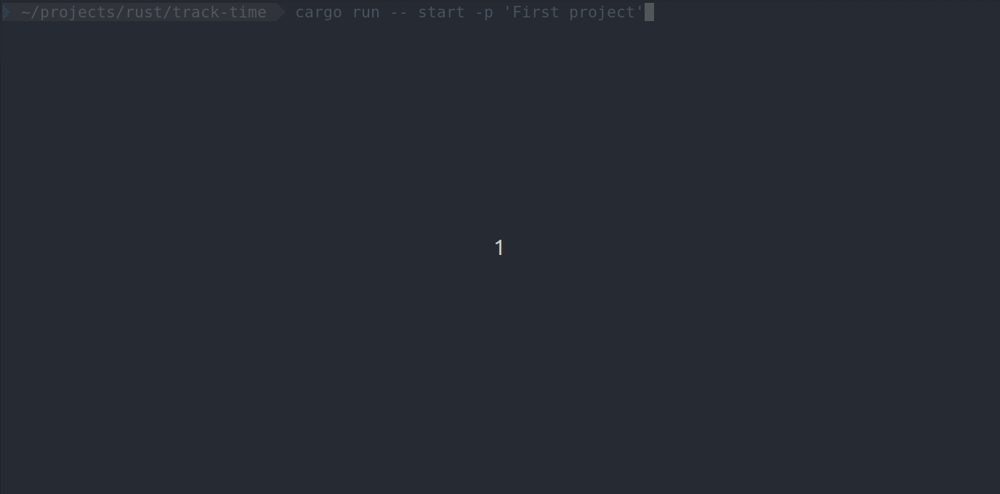
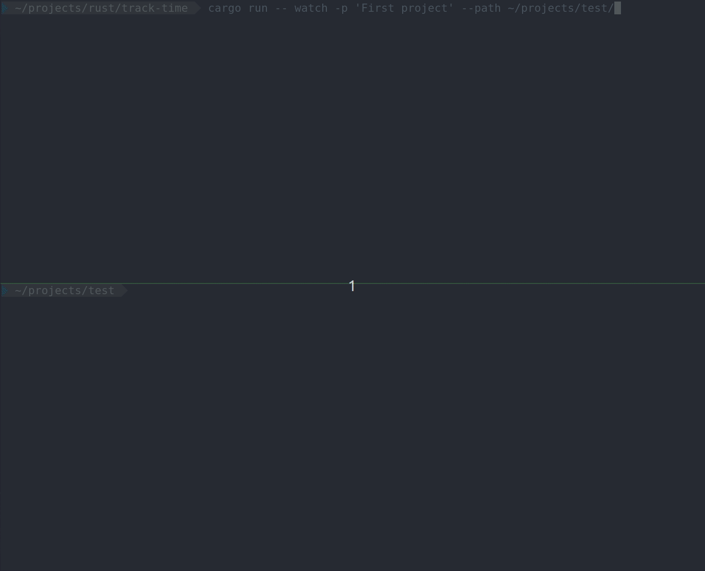

<h1 align="center">Time Tracker</h1>

<p align="center">
This is a command-line time-tracking tool that allows you to manually or automatically time-track your activity.
</p>

<h2 align="left">Manual tracking</h2>
In order to manually start time-tracking:

```
cargo run start --project <project_name>
```

<br>
To stop time-tracking:

```
cargo run stop --project <project_name>
```

Preview:
<div float="left">

</div>

<h2 align="left">Watcher tracking</h2>
In order to automatically time-track activity for a path:

```
cargo run watch --project <project_name> --path <folder_path>
```

Watcher flags user as inactive after a timeout period. Timeout time unit is in seconds, and the amount can be changed in
root `Config.toml` file.

Preview:
<div float="left">

</div>

This functionality is based on [notify](https://crates.io/crates/notify) crate.

<h2 align="left">Report</h2>
You can preview your projects and see total time for a single project.

<br>
To preview all projects:

```
cargo run projects
```

To preview tracked time of a project:

```
cargo run show --project <project_name>
```

Preview:

```
Project 'Hello world'
------------------------------------------------------
Started (UTC)        Stopped (UTC)        Duration (min)

Mar 11 2023 12:46    Mar 11 2023 12:46    50
------------------------------------------------------
Total: 50 min
```

